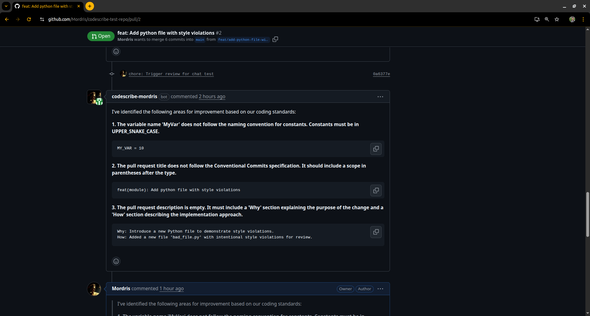

# CodeScribe: The AI Pull Request Assistant

CodeScribe is a fully automated, AI-powered agent that integrates with GitHub to supercharge your code review process. When a developer opens a Pull Request, CodeScribe automatically reviews the changes, provides insightful feedback based on your team's custom coding standards, suggests concrete refactors, and engages in a conversation to help developers merge better code, faster.

_This project was built from the ground up as a comprehensive portfolio piece demonstrating a wide range of skills in AI engineering, backend development, and DevOps._

---

## ✨ Features

- **🤖 Automated Code Reviews:** Analyzes pull requests for clarity, efficiency, and bugs.
- **💡 Intelligent Suggestions:** Provides one-click code suggestions for identified issues using GitHub's native UI.
- **🧠 RAG-Powered Knowledge:** Bases its reviews on a custom knowledge base of markdown files, ensuring it adheres to _your_ team's specific standards.
- **💬 Interactive Chat:** Developers can reply to the agent's comments to ask for clarification or request alternative suggestions, creating a collaborative dialogue.
- **🔬 AST-Powered Analysis:** Utilizes Abstract Syntax Trees to understand code structure for more advanced and reliable refactoring capabilities.
- **🚀 Containerized & Deployable:** The entire application is containerized with Docker and orchestrated with Docker Compose, allowing for a one-command startup.

---

## 🎬 Demo

### Initial Review

CodeScribe identifies multiple violations based on the custom knowledge base and provides structured, actionable feedback with one-click suggestions.



### Interactive Reply

A developer can ask for clarification, and CodeScribe uses the conversation history to provide a helpful, contextual reply, demonstrating a true understanding of the dialogue.


---

## 🏛️ System Architecture

CodeScribe is a distributed system composed of several microservices that communicate via a Redis job queue. This decoupled architecture ensures scalability and resilience.


**Key Components:**

- **GitHub App:** The entry point for all webhook events (`pull_request`, `issue_comment`).
- **Ingestion Service (FastAPI):** A secure, high-performance endpoint that validates and ingests webhooks, placing them onto the appropriate job queue.
- **Redis:** Serves as a robust message broker, decoupling the ingestion service from the processing workers.
- **Worker (Python):** The brains of the system. It picks up jobs, fetches PR data, performs RAG searches against the knowledge base, calls the LLM for analysis, and uses the GitHub API to post comments and suggestions.
- **Vector Database (ChromaDB):** Stores embeddings of the custom coding standards from the `knowledge_base` directory.
- **LLM Provider (OpenAI):** Provides the core intelligence for code analysis and generation.

---

## 🛠️ Tech Stack

- **Backend:** Python
- **Services:** FastAPI, Redis, ChromaDB
- **AI:** OpenAI API, LangChain (for RAG and Function Calling)
- **Containerization:** Docker & Docker Compose
- **GitHub Integration:** `githubkit`
- **Diagrams:** `diagrams` (Python library)

---

## 🚀 Getting Started

### Prerequisites

- Docker and Docker Compose
- Python 3.10+ and `pip`
- Graphviz (`sudo apt-get install graphviz` on Debian/Ubuntu)
- An active `ngrok` account and token
- An OpenAI API Key
- A GitHub App created with the necessary permissions and events subscribed.

### Setup Instructions

1.  **Clone the Repository:**

    ```bash
    git clone https://github.com/Mordris/CodeScribe-AI-Agent.git
    cd CodeScribe-AI-Agent
    ```

2.  **Configure Environment Variables:**

    - Create two environment files: `.env.local` (for running local scripts) and `.env.docker` (for the containerized services).
    - Fill in your GitHub App ID, Webhook Secret, OpenAI API Key, and other values. Your `.env.docker` should use service names (e.g., `REDIS_HOST=redis`), while `.env.local` should use `localhost`.

3.  **Build and Run the System:**

    - This single command builds the Docker images and starts all services (Redis, Chroma, FastAPI service, and the Worker).

    ```bash
    docker-compose up --build
    ```

4.  **Ingest Knowledge Base:**

    - In a **separate terminal**, set up a Python virtual environment and install dependencies: `pip install -r requirements.txt`.
    - Run the ingestion script to populate ChromaDB. This only needs to be done once, or whenever you update the markdown files in the `knowledge_base` directory.

    ```bash
    python ingest_docs.py
    ```

5.  **Expose the Webhook:**
    - In another **separate terminal**, run `ngrok http 8001`.
    - Copy the public `https://` URL provided by ngrok.
    - Go to your GitHub App settings, and paste this URL into the "Webhook URL" field, appending `/webhook`.

The agent is now live and will begin reviewing pull requests on your installed repositories!
